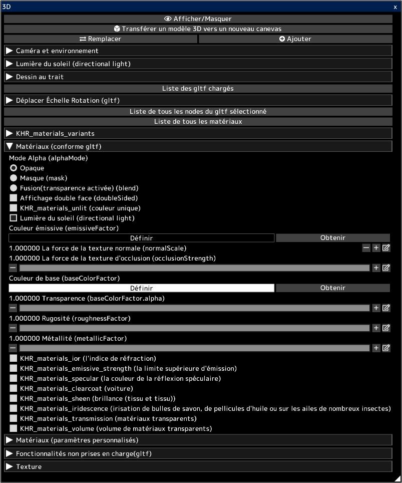

---
hide:
  - toc
---

<!-- https://steamcommunity.com/sharedfiles/filedetails/?id=2964324403 -->

Vous pouvez ouvrir des modèles 3D dans des fichiers gltf et glb.  
Vous pouvez transférer l'apparence de la 3D sur le canevas 2D tel quel.  
Vous pouvez également transférer le dessin au trait de la 3D sur la toile 2D.  
Vous pouvez utiliser le canevas transféré pour créer votre illustration. Par exemple, utilisez-le comme arrière-plan pour une illustration.

Les modèles 3D peuvent être créés dans un logiciel 3D tel que [blender](https://www.blender.org/) ou Autodesk Maya.  
Vous pouvez également télécharger des modèles 3D à partir de sites comme [sketchfab](https://sketchfab.com/).

Cliquer sur le bouton __"Remplacer"__ supprimera tous les modèles 3D précédemment chargés et ne laissera que le modèle 3D nouvellement chargé.  
Vous pouvez ajouter un modèle 3D en cliquant sur le bouton __"Ajouter"__.

Vous pouvez sélectionner un gltf parmi plusieurs gltfs chargés en cliquant sur __"Liste des gltf chargés"__.  
Vous pouvez déplacer/rotation/échelle le gltf sélectionné.

Vous pouvez sélectionner le nœud (objet) dans le gltf sélectionné en cliquant sur __"Liste de tous les nodes du gltf sélectionné"__.  
Vous pouvez déplacer/rotation/échelle le nœud sélectionné.

Vous pouvez sélectionner le matériau dans le gltf sélectionné en cliquant sur __"Liste de tous les matériaux"__.  
Vous pouvez ajuster les paramètres du matériau sélectionné.

La section __"Matériaux (conforme gltf)"__ répertorie les paramètres des matériaux selon la spécification gltf.  
Les modèles 3D créés avec un logiciel 3D tel que blender sont reflétés dans les paramètres de cet élément "Matériaux (conforme gltf)".  
[Consultez ce site pour enregistrer gltf dans blender.](https://docs.blender.org/manual/en/latest/addons/import_export/scene_gltf2.html#gltf-2-0)

Les modèles 3D téléchargés à partir de sites comme [sketchfab](https://sketchfab.com/) peuvent avoir un aspect différent dans sketchfab que dans icpaint.  
Dans ce cas, l'activation de KHR_materials_unlit (couleur unique) peut donner le même aspect.

* La "Lumière du soleil (directional light)" est activée pour tous les matériaux lors du chargement de fichiers gltf ou glb. Vous pouvez décocher la case "Lumière du soleil (directional light)" après l'importation.
* Les lumières ponctuelles et les spots ne sont pas pris en charge (point light, spot light) (KHR_lights_punctual)
* L'animation des modèles 3D n'est pas prise en charge.
* L'éclairage par couleur émissive (emissiveFactor) etc. n'est pas pris en charge.
* Il ne prend pas en charge la projection d'ombres pour les modèles 3D.
* KHR_draco_mesh_compression, EXT_meshopt_compression, KHR_mesh_quantization ne sont pas pris en charge.
* ktx2 (format d'image) n'est pas pris en charge (KHR_texture_basisu)

[Consultez ce site pour savoir comment modifier gltf avec un éditeur de texte.](https://github.com/KhronosGroup/glTF-Tutorials/blob/master/AddingMaterialExtensions/AddingMaterialExtensions_002_UsingVisualStudioCode.md#using-visual-studio-code)

Les descriptions officielles des paramètres dans la section __"Matériaux (conforme gltf)"__ sont:

* [la spécification de gltf](https://registry.khronos.org/glTF/specs/2.0/glTF-2.0.html)
* [description de mode alpha (alphaMode)](https://registry.khronos.org/glTF/specs/2.0/glTF-2.0.html#alpha-coverage)
* [description de double face (doubleSided)](https://registry.khronos.org/glTF/specs/2.0/glTF-2.0.html#double-sided)
* [KHR_materials_unlit (couleur unique)](https://github.com/KhronosGroup/glTF/tree/main/extensions/2.0/Khronos/KHR_materials_unlit#khr_materials_unlit)
* [description de base du matériel](https://github.com/KhronosGroup/glTF-Tutorials/blob/master/gltfTutorial/gltfTutorial_010_Materials.md#materials)
* [KHR_materials_ior (l'indice de réfraction)](https://github.com/KhronosGroup/glTF/tree/main/extensions/2.0/Khronos/KHR_materials_ior#khr_materials_ior)
* [KHR_materials_emissive_strength (la limite supérieure d'émission)](https://github.com/KhronosGroup/glTF/tree/main/extensions/2.0/Khronos/KHR_materials_emissive_strength#khr_materials_emissive_strength)
* [KHR_materials_specular (la couleur de la réflexion spéculaire)](https://github.com/KhronosGroup/glTF/tree/main/extensions/2.0/Khronos/KHR_materials_specular#khr_materials_specular)
* [KHR_materials_clearcoat (voiture)](https://github.com/KhronosGroup/glTF/tree/main/extensions/2.0/Khronos/KHR_materials_clearcoat#khr_materials_clearcoat)
* [KHR_materials_sheen (brillance (tissu et tissu))](https://github.com/KhronosGroup/glTF/tree/main/extensions/2.0/Khronos/KHR_materials_sheen#khr_materials_sheen)
* [KHR_materials_iridescence (irisation de bulles de savon, de pellicules d'huile ou sur les ailes de nombreux insectes)](https://github.com/KhronosGroup/glTF/tree/main/extensions/2.0/Khronos/KHR_materials_iridescence#khr_materials_iridescence)
* [KHR_materials_transmission (matériaux transparents)](https://github.com/KhronosGroup/glTF/tree/main/extensions/2.0/Khronos/KHR_materials_transmission#khr_materials_transmission-)
* [KHR_materials_volume (volume de matériaux transparents)](https://github.com/KhronosGroup/glTF/tree/main/extensions/2.0/Khronos/KHR_materials_volume#khr_materials_volume)
