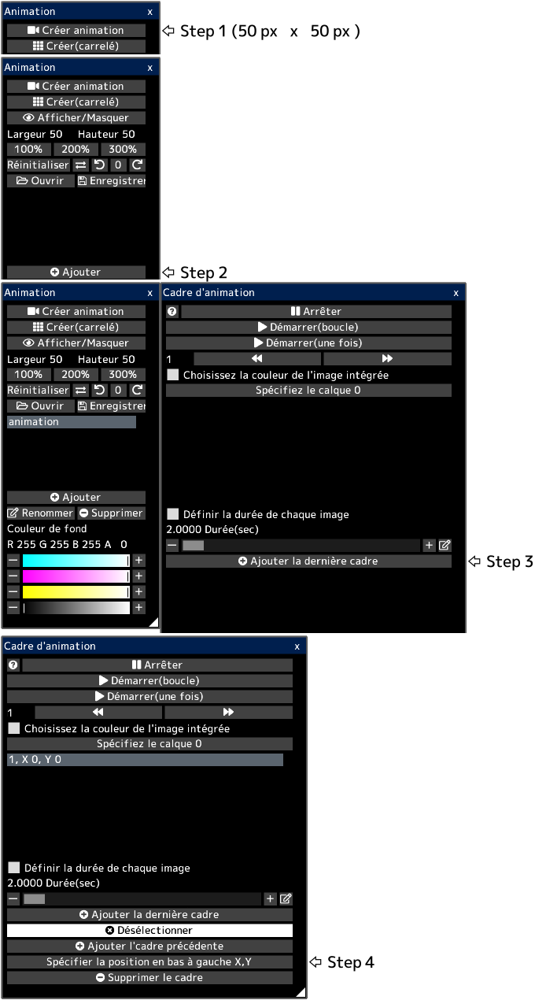

---
hide:
  - toc
---

<!-- https://steamcommunity.com/sharedfiles/filedetails/?id=2963174023 -->

L'animation exprime le mouvement en changeant continuellement d'images pour chaque image.

Chaque cadre est une zone (rectangle) dans le canevas.  
Tous les cadres sont affichés dans le canevas.

Lorsque vous ouvrez un fichier gif ou webp animé, le canevas est créé avec l'animation prête à être lue.  
Cependant, si la taille du canevas est trop grande, l'animation ne sera pas créée.

Par exemple, dans ce canevas, chaque image de l'animation est une zone carrée avec des nombres de 1 à 13.  
Lorsque vous jouez l'animation, elle se déroulera comme suit.

### Comment créer des animations

Tout d'abord, créez un canevas qui ressemble à ceci.  
Ensuite, ouvrez la fenêtre "Animation" en cliquant sur le bouton "Fenêtre d'animations" du menu "Canevas".

Vous créez 13 cadres.

Vous pouvez spécifier la position en bas à gauche de chaque cadre.  
__"1, X 0, Y 150"__ signifie que la position en bas à gauche de la première image est (0, 150).  
La position en bas à gauche du canevas est (0, 0).  
Dans cet exemple, chaque cadre a une largeur et une hauteur de 50 px.  
Lorsqu'un cadre est sélectionné, un cadre rectangulaire bleu s'affiche dans le canevas.

Si la case __"Choisissez la couleur de l'image intégrée"__ est cochée, l'animation jouera avec l'apparence actuelle du canevas.  
Si cette case à cocher est désactivée, l'animation sera lue avec uniquement l'apparence du calque spécifié.

L'animation sera jouée en cliquant sur le bouton __"Démarrer"__.  
Vous pouvez modifier la position et la taille de l'animation lue en sélectionnant l'outil d'animation.

Vous pouvez enregistrer l'animation sous forme de fichier gif ou webp.  
Étant donné que les fichiers gif ont un nombre limité de couleurs, vous ne pouvez enregistrer en tant que fichier gif que lorsque le calque de Pixel-art est sélectionné.  
Dans ce cas, vous devez dessiner l'animation dans le calque de Pixel-art.
