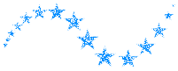
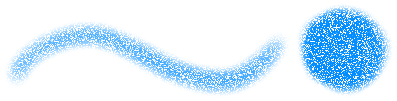
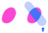

---
hide:
  - toc
---

<!-- https://steamcommunity.com/sharedfiles/filedetails/?id=2966221509 -->

Aérographe

・ Plus doux  
・ Espacement 0.5  
・ Taille 50  
・ Opacité 20%  
・ Taille minimale 100  
・ Opacité minimale 30%

---

・ Doux  
・ __Espacement 0.1__  
・ Taille 8  
・ Opacité 50%  
・ Taille minimale 0  
・ Opacité minimale 0%

---

・ Dur  
・ __Espacement 2.0__  
・ Taille 14  
・ Opacité 100%  
・ Taille minimale 0  
・ Opacité minimale 100%

---

・ __Image du cercle de brosse (star.tga)__  
・ Espacement 2.0  
・ Taille 14  
・ Opacité 100%  
・ Taille minimale 0  
・ Opacité minimale 100%

---

・ Dur  
・ Espacement 2.0  
・ Taille 14  
・ Opacité 100%  
・ Taille minimale 0  
・ Opacité minimale 100%  
・ __Image de base de brosse (tex.tga)__

---

・ __Image du cercle de brosse (star.tga)__  
・ Espacement 2.0  
・ Taille 18  
・ Opacité 100%  
・ Taille minimale 0  
・ Opacité minimale 100%  
・ __Image de base de brosse (tex.tga)__

---

・ __Image du cercle de brosse (img.tga)__  
・ Espacement 1.0  
・ Taille 35  
・ Opacité 100%  
・ Taille minimale 40  
・ Opacité minimale 40%  
・ Angle aléatoire 179°

---

・ Plus doux  
・ Espacement 0.3  
・ Taille 20  
・ Opacité 60%  
・ Taille minimale 70  
・ Opacité minimale 20%  
・ __Image de base de brosse (tex.tga)__

---

・ Plus doux  
・ Espacement 0.3  
・ Taille 20  
・ Opacité 60%  
・ Taille minimale 70  
・ Opacité minimale 20%  
・ __Image de base de brosse (circle.png)__  
・ Échelle 30% (Image de base de brosse)

circle.png

---

・ Dur  
・ Espacement 2.0  
・ Taille 18  
・ Opacité 100%  
・ Taille minimale 0  
・ Opacité minimale 100%  
・ __Ellipse 40%__  
・ Angle 0°

---

・ Dur  
・ Espacement 2.0  
・ Taille 18  
・ Opacité 100%  
・ Taille minimale 0  
・ Opacité minimale 100%  
・ __Ellipse 40%__  
・ __Angle 130°__

---

Si le bouton du haut de la fenêtre de l'outil est "__Marqueur__", il sera peint de manière à remplacer les couleurs.

---

Si le bouton du haut de la fenêtre de l'outil est "__Flou(couleur moyenne)__", il sera peint avec la couleur moyenne du dessin à l'intérieur du cercle du pinceau.  
Si la case "__Choisissez la couleur de l'image intégrée__" est cochée, la couleur moyenne est déterminée en fonction de l'apparence actuelle du canevas.  
Si cette case est décochée, la couleur moyenne est déterminée en fonction de ce qui est dessiné sur le calque actuel.

---

Si le bouton du haut de la fenêtre de l'outil est "__Mélanger__"

① Couleur mixte 70,  Couleur étendue 70, Quantité d'eau 10  
② Couleur mixte 90,  Couleur étendue 70, Quantité d'eau 10  
③ Couleur mixte 90,  Couleur étendue 0, Quantité d'eau 10 (peindre avec une seule ligne)  
④ Couleur mixte 90,  Couleur étendue 70, Quantité d'eau 10 (peindre avec une seule ligne)  
⑤ Couleur mixte 90,  Couleur étendue 0, Quantité d'eau 0  
⑥ Couleur mixte 90,  Couleur étendue 0, Quantité d'eau 70

・ Doux  
・ Espacement 0.1  
・ Taille 16  
・ Opacité 20%  
・ Taille minimale 50  
・ Opacité minimale 0%
