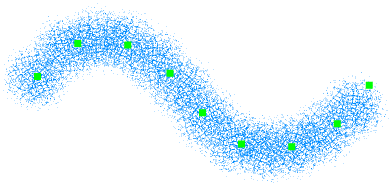
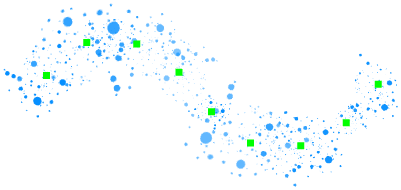

---
hide:
  - toc
---

<!-- https://steamcommunity.com/sharedfiles/filedetails/?id=2971126181 -->

L'outil "Brosse de la courbe" vous permet de modifier ultérieurement vos coups de brosse.  
Vous pouvez modifier votre coup de brosse en cliquant et en déplaçant les points de contrôle.  
Vous pouvez également modifier les paramètres de la brosse.

En déplaçant le point de contrôle vers la gauche/droite avec Shift + clic, vous pouvez modifier la pression du stylet à la position du point de contrôle.

|  | Comment utiliser |
| ------ | ----------- |
| Déplacer le point de contrôle       | Cliquez et faites glisser le point de contrôle |
| Si le point de contrôle doit être net ou une courbe lisse | Ctrl + clic sur le point de contrôle |
| Déplacer la courbe tout en conservant la forme de la courbe | Shift + Alt + cliquer et faire glisser |
| Rotation de la courbe autour de la position cliquée | Ctrl + Shift + Alt + cliquez et faites glisser vers la gauche ou vers la droite |

---

・ RGBA (0, 140, 255, 255)  
・ Plus doux  
・ Espacement 20  
・ Taille 50  
・ Opacité 10%

---

・ RGBA (0, 140, 255, 255)  
・ Image du cercle de brosse (img.tga)  
・ Espacement 30  
・ Taille 35  
・ Opacité 100%  
・ Angle aléatoire 179°

---

・ RGBA (0, 140, 255, 255)  
・ Image du cercle de brosse (fur.tga)  
・ Espacement 7  
・ Taille 30  
・ Opacité 100%  
・ Rotation le long du coup de brosse

---

・ RGBA (255, 77, 77, 255)  
・ Dur  
・ Espacement 3  
・ Taille 9  
・ Opacité 100%

Brosse double

・ RGBA (104, 255, 172, 255)  
・ Doux  
・ Ajout(Briller)  
・ Espacement 3  
・ Taille 8  
・ Opacité 80%

---

・ RGBA (0, 140, 255, 255)  
・ Image du cercle de brosse (splatter.tga)  
・ Espacement 35  
・ Taille 35  
・ Opacité 100%  
・ Taille aléatoire 120  
・ Opacité aléatoire 50%  
・ Angle aléatoire 179°

---

・ RGBA (255, 0, 0, 255)  
・ Image du cercle de brosse (star.tga)  
・ Espacement 8  
・ Taille 10  
・ Opacité 100%  
・ Taille aléatoire 110  
・ Position aléatoire 250  
・ Angle aléatoire 179°

Brosse double

・ RGBA (255, 255, 0, 255)  
・ Image du cercle de brosse (star.tga)  
・ Ajout(Briller)  
・ Espacement 8  
・ Taille 7  
・ Opacité 100%  
・ Taille aléatoire 110  
・ Position aléatoire 250  
・ Angle aléatoire 179°
