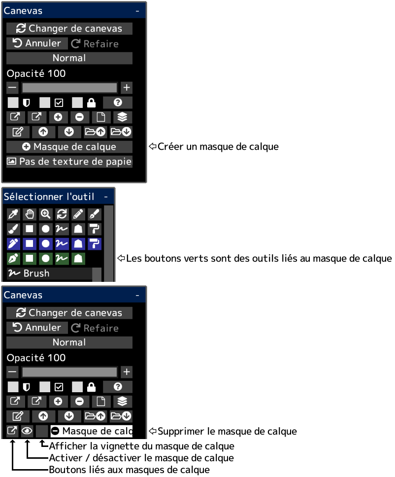

---
hide:
  - toc
---

<!-- https://steamcommunity.com/sharedfiles/filedetails/?id=2953907361 -->

Vous pouvez masquer partiellement le contenu du dessin à l'aide d'un masque de calque.  
Un masque de calque a une opacité (0 ~ 255).  
Vous pouvez également créer un masque de calque pour le groupe.  
Si vous créez un masque de calque pour le calque de réglage, vous pouvez ajuster la partie affectée par le calque de réglage.
