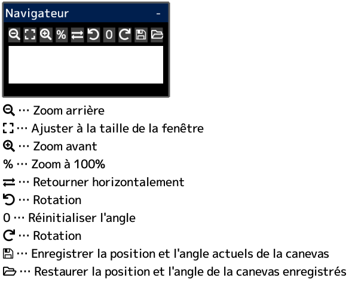

---
hide:
  - toc
---

<!-- https://steamcommunity.com/sharedfiles/filedetails/?id=2954723667 -->

Si vous cliquez à l'intérieur de la fenêtre "Navigateur", le canevas se déplacera de sorte que la position cliquée soit au centre de la fenêtre de l'application.
