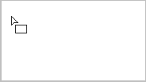
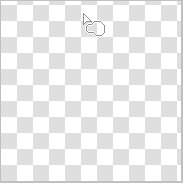

---
hide:
  - toc
---

<!-- https://steamcommunity.com/sharedfiles/filedetails/?id=2967691074 -->

Vous pouvez sélectionner l'outil "Rectangle" en cliquant sur le bouton ■ dans la fenêtre "Sélectionner l'outil".

Exemple de peinture avec RGBA (44,134,245,150)

Exemple de peinture avec __"Coins arrondis"__ coché et réglé à 60 %

Exemple de peinture avec la case à cocher __"Cadre"__ activée

Si vous cochez la case __"Rapport d'aspect"__, vous pouvez fixer le rapport de la hauteur et de la largeur du rectangle.  
Si vous cochez la case __"px"__, vous pouvez spécifier la hauteur et la largeur du rectangle en unités px.

### Outil "Cercle"

Exemple de peinture avec RGBA (44,134,245,150)

Exemple de peinture avec le bouton radio "Plus doux" sélectionné

Exemple de peinture avec __"Ellipse"__ coché et réglé sur 40

Exemple de peinture avec le bouton radio "Plus doux" sélectionné

### Outil "Lasso"

Exemple de peinture sans flou (RGBA (44,134,245,255))

Exemple de peinture avec flou 15x15 px (RGBA (44,134,245,150))

Exemple de peinture avec la case à cocher __"Mode de visualisation"__ activée (flou 3x3 px)

### Outil "Polygone"

Avec l'outil "Polygone", la position cliquée devient le sommet du polygone.  
Vous pouvez en annuler jusqu'à un.

---

Toutes ces méthodes de peinture peuvent également être peintes en __"Mode de fusion"__.  
Par exemple, vous pouvez le rendre plus sombre en peignant avec le mode de fusion "Produit".  
Aussi, par exemple, vous pouvez le rendre plus lumineux en le peignant avec un jaune blanchâtre dans le mode de fusion "Ajout(Briller)".
