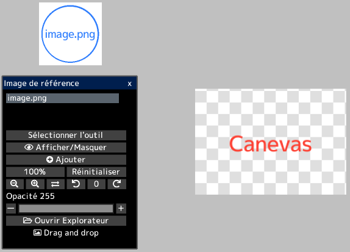
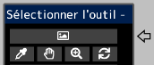

---
hide:
  - toc
---

<!-- https://steamcommunity.com/sharedfiles/filedetails/?id=2966628816 -->

En ouvrant l'image dans la fenêtre "Image de référence", vous pouvez afficher l'image séparément du canevas.  
Vous pouvez l'utiliser comme référence lors de la création d'illustrations.

Vous pouvez librement déplacer l'image de référence en cliquant sur le bouton __"Sélectionner l'outil"__.  
Vous pouvez également sélectionner des outils pour les images de référence dans la fenêtre "Sélectionner l'outil".

