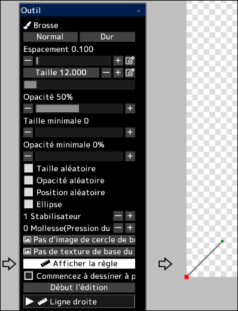

---
hide:
  - toc
---

<!-- https://steamcommunity.com/sharedfiles/filedetails/?id=2969761920 -->

Vous pouvez dessiner des coups de brosse le long de la règle.

En cliquant sur le bouton __"Afficher la règle"__, la règle sera affichée en bas à gauche du canevas.  
Cette règle a la même fonctionnalité que les courbes dans les calques vectoriels.  
Le point rouge dans la règle est le point de départ de la règle.

Lorsque __"Commencez à dessiner à partir du point de départ de la règle(point rouge)"__ n'est pas coché, le coup de pinceau partira du point de la distance la plus courte entre la position touchée avec le pinceau et la règle.

En cliquant sur le bouton __"Début l'édition"__, vous pourrez modifier la forme de la règle.

|  | Comment utiliser |
| ------ | ----------- |
| Sélectionnez le point de contrôle | Cliquez sur le point de contrôle |
| Déplacer le point de contrôle | Cliquez et faites glisser le point de contrôle |
| Supprimer le point de contrôle | Alt + clic sur le point de contrôle |
| Si le point de contrôle doit être net ou une courbe lisse | Ctrl + clic sur le point de contrôle |
| Ajouter un point de contrôle à la fin de la courbe | Cliquez n'importe où autre que le point de contrôle |
| Ajouter un point de contrôle au milieu de la courbe | Cliquez n'importe où sur la courbe |
| Ajouter un point de contrôle (angle aigu) à la fin de la courbe | Ctrl + clic n'importe où autre que le point de contrôle |
| Ajouter un point de contrôle (angle aigu) au milieu de la courbe | Ctrl + clic n'importe où sur la courbe |
| Déplacer la courbe tout en conservant la forme de la courbe | Shift + Alt + cliquer et faire glisser |
| Déplacer plusieurs points de contrôle ensemble | Shift + cliquer et faire glisser pour déplacer tous les points de contrôle à l'intérieur du cercle |
| Mettre à l'échelle la courbe | Ctrl + Alt + cliquez et faites glisser vers la gauche ou vers la droite |
| Rotation de la courbe autour de la position cliquée | Ctrl + Shift + Alt + cliquez et faites glisser vers la gauche ou vers la droite |

En cliquant sur le bouton __"Terminer l'édition"__, vous pourrez à nouveau dessiner avec le pinceau.
