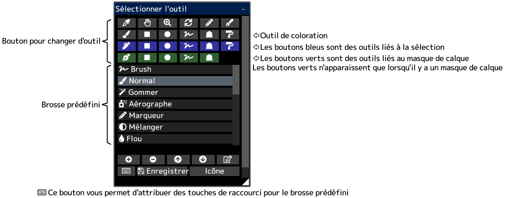

---
hide:
  - toc
---

<!-- https://steamcommunity.com/sharedfiles/filedetails/?id=2953785664 -->

Vous pouvez enregistrer les paramètres de préréglage actuels du pinceau en appuyant sur le bouton __"Enregistrer"__.  
Les paramètres des pinceaux de sélection, des pinceaux de masque de calque et des pinceaux courbes sont enregistrés en même temps.
