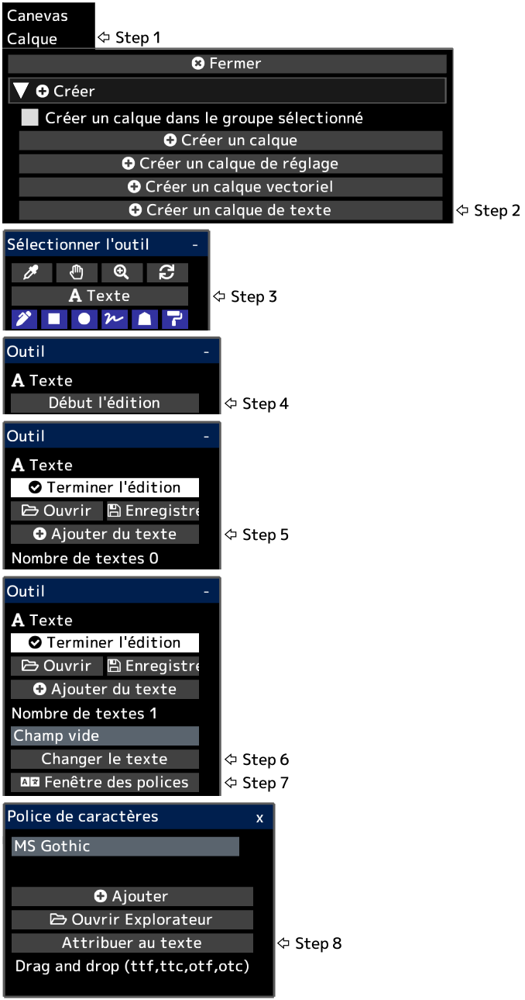

---
hide:
  - toc
---

<!-- https://steamcommunity.com/sharedfiles/filedetails/?id=2954863903 -->

Le texte est créé en bas à gauche du canevas.  
Après avoir cliqué sur __"Terminer l'édition"__, l'opacité du calque, le mode de fusion, le masque de calque, etc. seront appliqués.

Vous pouvez convertir un calque de texte en calque de dessin en cliquant sur le bouton __"Rastériser le calque"__ dans le menu "Calque".
