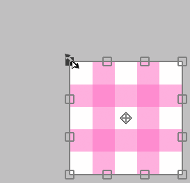

---
hide:
  - toc
---

<!-- https://steamcommunity.com/sharedfiles/filedetails/?id=2955813429 -->

### Si le curseur est à l'intérieur de la zone de transformation

Vous pouvez le déplacer librement en cliquant.

Vous pouvez le déplacer uniquement horizontalement ou uniquement verticalement en appuyant sur Shift + clic.

### Si le curseur est à l'extérieur de la zone de transformation

Vous pouvez le faire pivoter en cliquant.

Vous pouvez le faire pivoter autour de l'ancre en appuyant sur Ctrl + clic.

### Si le curseur est sur l'ancre

Vous ne pouvez déplacer que l'ancre en cliquant.

### Si le curseur est sur le bord ( □ ) supérieur, inférieur, gauche ou droit

Vous pouvez déplacer le bord en cliquant.

Vous pouvez déplacer les deux côtés en même temps sans déplacer la position centrale par Alt + clic.

Vous pouvez déplacer librement le bord en appuyant sur Ctrl + clic.

Vous pouvez déplacer le bord le long de sa direction en appuyant sur Ctrl + Shift + clic.

### Si le curseur est sur 4 sommets ( □ )

Vous pouvez déplacer le sommet en cliquant.

Vous pouvez le mettre à l'échelle et le faire pivoter avec Alt + clic.

Vous pouvez le mettre à l'échelle uniformément en appuyant sur Shift + clic.

Vous pouvez le mettre à l'échelle uniformément sans déplacer la position centrale en appuyant sur Shift + Alt + clic.

---

Vous ne pouvez déplacer librement que le sommet en appuyant sur Ctrl + clic.  
Dans ce cas, l'apparence change de trois manières.

#### Ctrl + clic dans "Transformer"

#### Ctrl + clic dans "Transformation de la perspective" avec "Perspective" désactivé

#### Ctrl + clic dans "Transformation de la perspective" avec "Perspective" activé

Vous pouvez revenir à l'état avant la transformation en appuyant sur le bouton __"Réinitialiser"__.

* Transformation(taille de la canevas)
* Déplacer Échelle Rotation(taille de la canevas)
* Transformation de la perspective
* Filtre Fluidité
* Filtre Retouche

Ces cinq méthodes peuvent enregistrer le contenu de la transformation.  
Si enregistré, vous pouvez appliquer la même transformation à un autre calque.

Si vous souhaitez transformer en spécifiant une valeur numérique, veuillez utiliser __"Déplacer Échelle Rotation"__.  
Par exemple, si vous souhaitez le réduire à 50 % ou le faire pivoter de 45 degrés.
