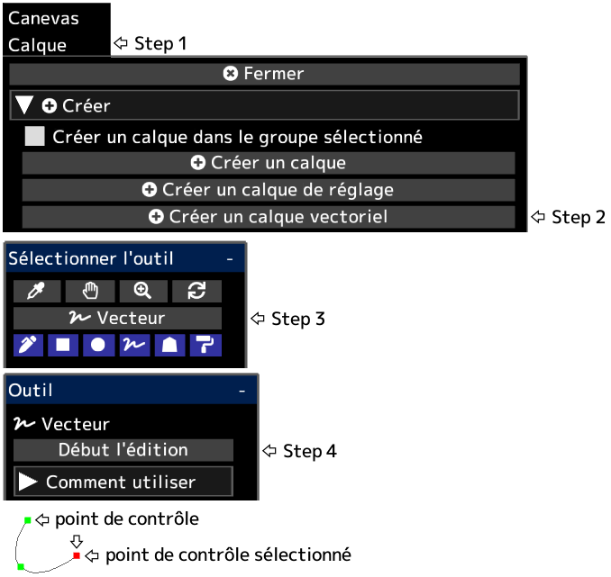

---
hide:
  - toc
---

<!-- https://steamcommunity.com/sharedfiles/filedetails/?id=2955215516 -->

Après avoir cliqué sur __"Terminer l'édition"__, l'opacité du calque, le mode de fusion, le masque de calque, etc. seront appliqués.

Vous pouvez convertir un calque vectoriel en calque de dessin en cliquant sur le bouton __"Rastériser le calque"__ dans le menu "Calque".

|  | Comment utiliser |
| ------ | ----------- |
| Sélectionnez le point de contrôle | Cliquez sur le point de contrôle |
| Désélectionner le point de contrôle | Alt + clic n'importe où autre que le point de contrôle |
| Déplacer le point de contrôle | Cliquez et faites glisser le point de contrôle |
| Supprimer le point de contrôle | Alt + clic sur le point de contrôle |
| Si le point de contrôle doit être net ou une courbe lisse | Ctrl + clic sur le point de contrôle |
| Ajouter un point de contrôle à la fin de la courbe | Cliquez n'importe où autre que le point de contrôle avec le point de contrôle sélectionné |
| Ajouter un point de contrôle au milieu de la courbe | Cliquez n'importe où sur la courbe avec le point de contrôle sélectionné |
| Ajouter un point de contrôle (angle aigu) à la fin de la courbe | Ctrl + clic n'importe où autre que le point de contrôle avec le point de contrôle sélectionné |
| Ajouter un point de contrôle (angle aigu) au milieu de la courbe | Ctrl + clic n'importe où sur la courbe avec le point de contrôle sélectionné |
| Créer un point de contrôle comme une autre courbe | Cliquez n'importe où autre que le point de contrôle sans point de contrôle sélectionné |
| Créer un point de contrôle (angle aigu) comme une autre courbe | Ctrl + clic n'importe où autre que le point de contrôle sans point de contrôle sélectionné |
| Supprimer la courbe | Répétez Alt + clic sur tous les points de contrôle, ou cliquez sur le bouton "Supprimer la courbe" |
| Déplacer la courbe tout en conservant la forme de la courbe | Shift + Alt + cliquer et faire glisser avec le point de contrôle sélectionné |
| Dupliquer la courbe | Ctrl + Shift + cliquer et faire glisser avec le point de contrôle sélectionné |
| Déplacer plusieurs points de contrôle ensemble | Shift + cliquer et faire glisser pour déplacer tous les points de contrôle à l'intérieur du cercle |
| Mettre à l'échelle la courbe | Ctrl + Alt + cliquez et faites glisser vers la gauche ou vers la droite |
| Rotation de la courbe autour de la position cliquée | Ctrl + Shift + Alt + cliquez et faites glisser vers la gauche ou vers la droite |
